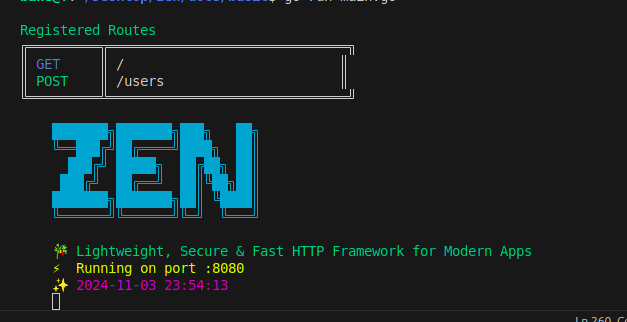

# Zen

> ⚠️ **Development Mode**: This project is currently in active development. Features and usage guides may change.
> Be sure to check the CHANGELOG for usage updates, patches and version changes.

Zen is a lightweight and fast HTTP framework for Go, focusing on simplicity and performance while providing enterprise-grade features for modern web applications. Zen has a security-first focus providing a range of middleware such as authentication, ratelimiting, api gateway functionaly and CORS support.


> All important tools in one project, which makes it ideal.

<p align="start">
    
</p>

## Table of Contents

- [Installation](#installation)
- [Basic Example](#basic-example)
- [Middleware Documentation](#middleware-documentation)
  - [CORS Middleware](#cors-middleware)
  - [Authentication](#authentication-middleware)
  - [Rate Limiter](#rate-limiter-middleware)
  - [Security Middleware](#security-middleware)
  - [Logger](#logger)
- [Context Functions](#context-functions)

  - [Request Handling](#request-handling)

    - [Getting IP Address](#getting-ip-address)
    - [Parsing JSON Bodies](#parsing-json-bodies)
    - [Getting Request Headers](#getting-request-headers)
    - [URL Parameters](#url-parameters)
    - [Query Parameters](#query-parameters)
    - [Host Address](#getting-host-address)
    - [Request Method](#getting-request-method)
    - [URL Path](#getting-url-path)

  - [Response Functions](#response-functions)
    - [Success Response](#success-responses)
    - [Error Response](#error-responses)
    - [JSON Responses](#json-responses)
    - [Text Responses](#text-responses)
    - [Setting Headers](#setting-headers)
    - [Status Codes](#status-codes)
  - [Cookie Management](#cookie-management)
    - [Setting Cookies](#setting-cookies)
    - [Getting Cookies](#getting-cookies)
  - [Content Type Management](#content-type-management)
  - [Context Management](#context-management)
    - [Timeout and Cancellation](#timeout-and-cancellation)
    - [Context Values](#context-values)

- [Complete Example with All Features](#complete-example-with-all-features)
- [Best Practices](#best-practices)
- [Contributing](#contributing)
- [Documentation](#documentation)
- [License](#license)

### Installation

```bash
go get github.com/ThembinkosiThemba/zen@v0.2.1
```

### Basic Example

```go
package main

import (
    "github.com/ThembinkosiThemba/zen"
    "github.com/ThembinkosiThemba/zen/pkg/middleware"
)

func main() {
    // Create new Zen app instance
    app := zen.New()

    // Setting the Zen mode to either DevMode / Production
    zen.SetCurrentMode(zen.DevMode)

    // Global middleware
    app.Apply(
        zen.Logger(),                    // Request logging
        middleware.SecurityMiddleware(), // Security features
        middleware.DefaultCors(),        // CORS protection
        middleware.RateLimiter(),        // API rate limiting
    )

    // Registering a basic GET route
    app.GET("/", func(c *zen.Context) {
        c.Success(http.StatusOK, nil, "Welcome to Zen!")
    })

    // Start server
    app.Serve(":8080")
}
```

## Middleware Documentation

Zen offers a ton of pre-built useful middleware support that are necessary for building servers. These middleware includes:

- Cross-Origin-Resource-Sharing (CORS)
- Authentication (JWT-auth)
- Rate Limiting (beta)
- Security Headers & Protections (beta)
- API gateway (beta)

### CORS Middleware

Configure Cross-Origin Resource Sharing with fine-grained control:

```go
corsConfig := middleware.CORSConfig{
    AllowOrigins:     []string{"https://example.com"},
    AllowMethods:     []string{"GET", "POST", "PUT", "DELETE"},
    AllowHeaders:     []string{"Origin", "Content-Type", "Authorization"},
    AllowCredentials: true,
    MaxAge:          3600,
}
app.Apply(middleware.CORSWithConfig(corsConfig))
```

Read the full detailed documentation for [CORS](docs/cors.md) at this link.

### Authentication

Zen provides a flexible JWT-based authentication system with features including:

- Multiple token sources (Header, Query, Cookie)
- Custom claims support
- Role-based access control
- Configurable unauthorized responses

Read the full detailed documentation for [Authentication](docs/auth.md) at this link.

```go
// Basic Auth Setup
app.Apply(middleware.Auth("your-secret-key"))

// Advanced Configuration
authConfig := middleware.AuthConfig{
    SecretKey:     "your-secret-key",
    TokenLookup:   "header:Authorization",
    TokenHeadName: "Bearer",
    SkipPaths:     []string{"/public"},
}
app.Apply(middleware.AuthWithConfig(authConfig))
```

Support for other authentication strategies will be added including `oauth`, `csrf-protection`, `sessions` and more.

### Rate Limiter Middleware:

Zen also comes pre-built will rate-limiting strategies to prevent your applications against resource abuse and attacks.

Check out the detailed [Rate Limiter](docs/rate_limiter.md) documentation for usage guides and help.

```go
rateConfig := middleware.RateLimitConfig{
    Strategy:   middleware.SlidingWindow,
    Limit:      100,
    Window:     time.Minute,
    BurstLimit: 20,
    ExcludePaths: []string{"/health"},
}
app.Apply(middleware.RateLimiterMiddleware(rateConfig))
```

Features:

- Multiple rate limiting strategies (IP-based, Sliding Window)
- Configurable time windows and limits
- Burst handling
- Path exclusions

### Security Middleware

Comprehensive security features:

```go
securityConfig := middleware.SecurityConfig{
    Strategies: middleware.HeaderSecurity |
               middleware.RequestSanitization,
    HSTS: true,
    CSPDirectives: &middleware.ContentSecurityPolicyDirective{
        DefaultSrc: []string{"'self'"},
    },
    MaxRequestSize: 5 * 1024 * 1024,
}
app.Apply(middleware.SecurityMiddleware(securityConfig))
```

Features:

- Security Headers (HSTS, CSP, X-Frame-Options)
- Request Sanitization
- IP Security
- Session Security

### Logger

Go to [Logger Documentation](/docs/logger.md) to see how you can use zen logger and further customize it.

## Context Functions

Zen provides a powerful context object that encapsulates the request and response. Here are the comprehensive functions available:

### Request Handling

#### Getting IP Address

Retrieve the client's IP address with fallback options:

```go
app.GET("/ip", func(c *zen.Context) {
    clientIP := c.GetClientIP() // Checks X-Real-IP, X-Forwarded-For, and RemoteAddr
    c.Success(http.StatusOK, clientIP, "OK")
})
```

#### Parsing JSON Bodies

Multiple options for handling JSON request bodies:

```go
type UserRequest struct {
    Name  string `json:"name"`
    Email string `json:"email"`
}

app.POST("/user", func(c *zen.Context) {
    var user UserRequest

    // Option 1: Basic parsing
    if err := c.ParseJSON(&user); err != nil {
        c.Error(http.StatusBadRequest, err.Error())
        return
    }

    // Option 2: Try parsing with boolean response
    if !c.TryParseJSON(&user) {
        c.Error(http.StatusBadRequest, err.Error(), "Invalid JSON")
        return
    }

    // Option 3: Parse with automatic error response
    if !c.ParseJSONWithError(&user) {
        return // Error response is automatically sent
    }

    c.JSON(http.StatusOK, user)
})
```

#### Getting Request Headers

```go
app.GET("/headers", func(c *zen.Context) {
    userAgent := c.GetHeader("User-Agent")
    c.Success(http.StatusOK, userAgent, "OK")
})
```

#### URL Parameters

Access URL path parameters:

```go
app.GET("/users/:id", func(c *zen.Context) {
    userID := c.GetParam("id")
    c.Success(http.StatusOK, userID, "OK")
})
```

#### Query Parameters

Handle query parameters with multiple methods:

```go
app.GET("/search", func(c *zen.Context) {
    // Single parameter
    query := c.GetQueryParam("q")

    // All query parameters
    allParams := c.GetQueryParams()

    // Setting query parameters
    c.SetQueryParam("page", "2")

    c.JSON(http.StatusOK, zen.M{
        "query": query,
        "allParams": allParams,
    })
})
```

#### Getting Request Method

```go
method := c.GetMethod()
```

#### Getting URL path

```go
path := c.GetURLPath()
```

#### Getting Host Address

```go
host := c.GetHost()
```

### Response Functions

#### Success Responses

Send successful responses with data:

```go
app.GET("/users", func(c *zen.Context) {
    users := []User{...}
    c.Success(http.StatusOK, users, "Users retrieved successfully")
})

// Example with map data
app.GET("/profile", func(c *zen.Context) {
    c.Success(http.StatusOK, zen.M{
        "user": user,
        "settings": settings,
        "lastLogin": time.Now(),
    }, "Profile retrieved successfully")
})
```

#### Error Responses

Send error responses with optional details:

```go
// Basic error
app.GET("/user/:id", func(c *zen.Context) {
    c.Error(http.StatusNotFound, "User not found")
})

// Error with details
app.POST("/users", func(c *zen.Context) {
    if err := validateUser(user); err != nil {
        c.Error(http.StatusBadRequest, "Validation failed", err)
        return
    }
})
```

For more details, visit the [Response Helpers Documentation](docs/response.md).

#### JSON Responses

Send JSON responses with proper content type:

```go
app.GET("/data", func(c *zen.Context) {
    c.JSON(http.StatusOK, "some data value")
})
```

#### Text Responses

Send plain text responses:

```go
app.GET("/text", func(c *zen.Context) {
    c.Text(http.StatusOK, "Hello %s", "World")
})
```

#### Setting Headers

Manage response headers:

```go
app.GET("/custom-headers", func(c *zen.Context) {
    c.SetHeader("X-Custom-Header", "value")
    c.JSON(http.StatusOK, "OK")
})
```

#### Status Codes

Set HTTP status codes:

```go
app.GET("/status", func(c *zen.Context) {
    c.Status(http.StatusAccepted)
})
```

### Cookie Management

#### Setting Cookies

```go
app.GET("/set-cookie", func(c *zen.Context) {
    cookie := &http.Cookie{
        Name:     "session",
        Value:    "123",
        Path:     "/",
        MaxAge:   3600,
        HttpOnly: true,
        Secure:   true,
    }
    c.SetCookie(cookie)
    c.JSON(http.StatusOK, "cookie set")
})
```

#### Getting Cookies

```go
app.GET("/get-cookie", func(c *zen.Context) {
    cookie, err := c.GetCookie("session")
    if err != nil {
        c.JSON(http.StatusBadRequest, zen.M{
            "error": "Cookie not found",
        })
        return
    }
    c.JSON(http.StatusOK, zen.M{
        "cookieValue": cookie.Value,
    })
})
```

### Content Type Management

```go
app.GET("/content-type", func(c *zen.Context) {
    c.SetContentType("application/json")
    contentType := c.GetContentType()
    c.JSON(http.StatusOK, zen.M{
        "contentType": contentType,
    })
})
```

### Context Management

#### Timeout and Cancellation

```go
app.GET("/timeout", func(c *zen.Context) {
    ctx, cancel := c.DefaultContext() // 10 second timeout
    defer cancel()

    select {
    case <-ctx.Done():
        c.JSON(http.StatusGatewayTimeout, zen.M{
            "error": "Request timeout",
        })
    case <-time.After(5 * time.Second):
        c.JSON(http.StatusOK, zen.M{
            "message": "Operation completed",
        })
    }
})
```

#### Context Values

```go
app.GET("/context-values", func(c *zen.Context) {
    // Set context value
    type key string
    userKey := key("user")
    newCtx := c.WithValue(userKey, "john")

    // Get context value
    if user, ok := newCtx.Value(userKey).(string); ok {
        c.JSON(http.StatusOK, zen.M{
            "user": user,
        })
    }
})
```

## Complete Example with All Features

```go
package main

import (
    "github.com/ThembinkosiThemba/zen"
    "github.com/ThembinkosiThemba/zen/pkg/middleware"
    "time"
)

func main() {
    // Create new Zen app
    app := zen.New()

    // Configure security
    securityConfig := middleware.SecurityConfig{
        Strategies: middleware.HeaderSecurity | middleware.RequestSanitization,
        HSTS:       true,
        HSTSMaxAge: 63072000,
    }

    // Configure CORS
    corsConfig := middleware.CORSConfig{
        AllowOrigins:     []string{"http://localhost:3000"},
        AllowMethods:     []string{"GET", "POST", "PUT", "DELETE"},
        AllowHeaders:     []string{"Origin", "Content-Type", "Authorization"},
        AllowCredentials: true,
        MaxAge:          3600,
    }

    // Configure rate limiting
    rateConfig := middleware.RateLimitConfig{
        Strategy:   middleware.SlidingWindow,
        Limit:      100,
        Window:     time.Minute,
        BurstLimit: 20,
    }

    // Configure authentication
    authConfig := middleware.AuthConfig{
        SecretKey:   "your-secret-key",
        SkipPaths:   []string{"/login", "/public"},
        TokenLookup: "header:Authorization",
    }

    // Apply middleware
    app.Apply(
        zen.Logger(),
        middleware.SecurityMiddleware(securityConfig),
        middleware.CORSWithConfig(corsConfig),
        middleware.RateLimiterMiddleware(rateConfig),
        middleware.AuthWithConfig(authConfig),
    )

    // Public routes
    app.GET("/public", func(c *zen.Context) {
        c.Success(http.StatusOK, nil, "public endpoint")
    })

    // Protected routes
    api := app.Group("/api")
    api.GET("/protected", func(c *zen.Context) {
        claims, _ := middleware.GetClaims[*middleware.BaseClaims](c)
        c.Success(http.StatusOK, claims.UserID, "public endpoint")
    })

    app.Serve(":8080")
}
```

## Best Practices

1. **Security First**:

   - Always enable security middleware in production
   - Use HTTPS
   - Configure appropriate rate limits
   - Implement proper authentication

2. **Performance Optimization**:

   - Enable hot reload only in development
   - Configure appropriate request size limits
   - Use route groups for better organization

3. **Middleware Order**:
   - Logger (first to log all requests)
   - Security (early protection)
   - CORS (handle preflight)
   - Rate Limiter
   - Authentication (after rate limiting)

## Contributing

1. Fork the repository
2. Create your feature branch
3. Commit your changes
4. Push to the branch
5. Create a Pull Request

## Documentation

Detailed documentation for each component:

- [Security](docs/security.md)

## License

MIT License - see [LICENSE](/LICENSE) file for details
