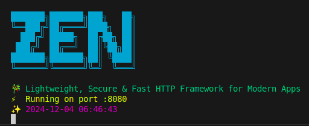

# Zen Web Framework

Zen is a lightweight and fast HTTP framework for Go, focusing on simplicity and performance while providing enterprise-grade features for modern web applications.

<p align="start">
    
</p>

## Features

- 🚀 Lightweight and Fast
- 🛡️ Comprehensive Middleware Support
  - Authentication (JWT-based)
  - CORS Management
  - Rate Limiting
  - Security Headers & Protections
- 🎯 Simple & Intuitive Routing
- 📝 Request Logging
- ⚡ Hot Reloading for Development
- 🔒 Enterprise-Grade Security

## Quick Start

### Installation

```bash
go get github.com/ThembinkosiThemba/zen
```

### Basic Example

```go
package main

import (
    "github.com/ThembinkosiThemba/zen/pkg/zen"
    "github.com/ThembinkosiThemba/zen/pkg/middleware"
)

func main() {
    // Create new Zen app
    app := zen.New()

    // Global middleware
    app.Use(
        middleware.Logger(),           // Request logging
        middleware.SecurityMiddleware(), // Security features
        middleware.DefaultCors(),      // CORS protection
        middleware.RateLimiter(),      // API rate limiting
    )

    // Basic routes
    app.GET("/", func(c *zen.Context) {
        c.JSON(http.StatusOK, map[string]interface{}{
            "message": "Welcome to Zen!",
        })
    })

    // Start server
    app.Serve(":8080")
}
```

## Middleware Documentation

### Authentication Middleware

Zen provides a flexible JWT-based authentication system with features including:

- Multiple token sources (Header, Query, Cookie)
- Custom claims support
- Role-based access control
- Configurable unauthorized responses

```go
// Basic Auth Setup
app.Use(middleware.Auth("your-secret-key"))

// Advanced Configuration
authConfig := middleware.AuthConfig{
    SecretKey:     "your-secret-key",
    TokenLookup:   "header:Authorization",
    TokenHeadName: "Bearer",
    SkipPaths:     []string{"/public"},
}
app.Use(middleware.AuthWithConfig(authConfig))
```

### CORS Middleware

Configure Cross-Origin Resource Sharing with fine-grained control:

```go
corsConfig := middleware.CORSConfig{
    AllowOrigins:     []string{"https://example.com"},
    AllowMethods:     []string{"GET", "POST", "PUT", "DELETE"},
    AllowHeaders:     []string{"Origin", "Content-Type", "Authorization"},
    AllowCredentials: true,
    MaxAge:          3600,
}
app.Use(middleware.CORSWithConfig(corsConfig))
```

### Rate Limiter Middleware

Protect your APIs with sophisticated rate limiting:

```go
rateConfig := middleware.RateLimitConfig{
    Strategy:   middleware.SlidingWindow,
    Limit:      100,
    Window:     time.Minute,
    BurstLimit: 20,
    ExcludePaths: []string{"/health"},
}
app.Use(middleware.RateLimiterMiddleware(rateConfig))
```

Features:

- Multiple rate limiting strategies (IP-based, Sliding Window)
- Configurable time windows and limits
- Burst handling
- Path exclusions

### Security Middleware

Comprehensive security features:

```go
securityConfig := middleware.SecurityConfig{
    Strategies: middleware.HeaderSecurity |
               middleware.RequestSanitization,
    HSTS: true,
    CSPDirectives: &middleware.ContentSecurityPolicyDirective{
        DefaultSrc: []string{"'self'"},
    },
    MaxRequestSize: 5 * 1024 * 1024,
}
app.Use(middleware.SecurityMiddleware(securityConfig))
```

Features:

- Security Headers (HSTS, CSP, X-Frame-Options)
- Request Sanitization
- IP Security
- Session Security

## Complete Example with All Features

```go
package main

import (
    "github.com/ThembinkosiThemba/zen/pkg/zen"
    "github.com/ThembinkosiThemba/zen/pkg/middleware"
    "time"
)

func main() {
    // Create new Zen app
    app := zen.New()

    // Configure security
    securityConfig := middleware.SecurityConfig{
        Strategies: middleware.HeaderSecurity | middleware.RequestSanitization,
        HSTS:       true,
        HSTSMaxAge: 63072000,
    }

    // Configure CORS
    corsConfig := middleware.CORSConfig{
        AllowOrigins:     []string{"http://localhost:3000"},
        AllowMethods:     []string{"GET", "POST", "PUT", "DELETE"},
        AllowHeaders:     []string{"Origin", "Content-Type", "Authorization"},
        AllowCredentials: true,
        MaxAge:          3600,
    }

    // Configure rate limiting
    rateConfig := middleware.RateLimitConfig{
        Strategy:   middleware.SlidingWindow,
        Limit:      100,
        Window:     time.Minute,
        BurstLimit: 20,
    }

    // Configure authentication
    authConfig := middleware.AuthConfig{
        SecretKey:   "your-secret-key",
        SkipPaths:   []string{"/login", "/public"},
        TokenLookup: "header:Authorization",
    }

    // Apply middleware
    app.Use(
        middleware.Logger(),
        middleware.SecurityMiddleware(securityConfig),
        middleware.CORSWithConfig(corsConfig),
        middleware.RateLimiterMiddleware(rateConfig),
        middleware.AuthWithConfig(authConfig),
    )

    // Public routes
    app.GET("/public", func(c *zen.Context) {
        c.JSON(http.StatusOK, map[string]interface{}{
            "message": "Public endpoint",
        })
    })

    // Protected routes
    api := app.Group("/api")
    api.GET("/protected", func(c *zen.Context) {
        claims, _ := middleware.GetClaims[*middleware.BaseClaims](c)
        c.JSON(http.StatusOK, map[string]interface{}{
            "message": "Protected endpoint",
            "user":    claims.UserID,
        })
    })

    // Start server with hot reload
    zen.HotReloadEnabled = true // Enable hot reloading
    app.Serve(":8080")
}
```

## Best Practices

1. **Security First**:

   - Always enable security middleware in production
   - Use HTTPS
   - Configure appropriate rate limits
   - Implement proper authentication

2. **Performance Optimization**:

   - Enable hot reload only in development
   - Configure appropriate request size limits
   - Use route groups for better organization

3. **Middleware Order**:
   - Logger (first to log all requests)
   - Security (early protection)
   - CORS (handle preflight)
   - Rate Limiter
   - Authentication (after rate limiting)

## Contributing

1. Fork the repository
2. Create your feature branch
3. Commit your changes
4. Push to the branch
5. Create a Pull Request

## Documentation

Detailed documentation for each component:

- [Authentication](docs/auth.md)
- [CORS](docs/cors.md)
- [Rate Limiter](docs/rate_limiter.md)
- [Security](docs/security.md)

## License

MIT License - see LICENSE file for details
